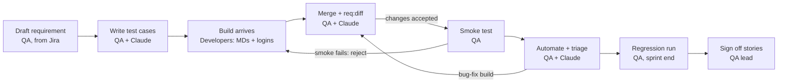

# Sprint QA Process

How the QA team runs each sprint with this framework. Only QA uses the framework; developers send their notes and
credentials with each build. Full guide: [Getting Started Guide](Getting-Started-Guide.pdf), chapter 6 "Working in sprints".
Web version: [sprint-qa-process.html](sprint-qa-process.html).

## Who does what

| Who | Responsibility |
| --- | --- |
| QA team | Owns the framework and every file in it. Writes a requirement file for each story before the build, then the test cases. Merges the developer notes, automates, triages failures, raises bugs and signs off. |
| Developers | Don't use the framework. With every build they send one MD file per story in their own format, the build details, and the credentials through a secure channel. |
| Claude (in VS Code) | Drafts test cases, merges developer notes, finds locators in the live build, writes and runs the tests. QA reviews everything it produces. |

## Starting a new web app

Do this once per project, before the first sprint. The examples use the app name `prj`.

1. **Create the app folder:** `npm run new:app -- prj --platforms web,api` (leave out `api` if there are no API tests).
   It creates `apps/prj/` with `requirements/`, `test-cases/`, `sprints/`, the code folders, a starter `app.config.ts`,
   `fixtures.ts` and `.env`.
2. **Make it the active app:** `APP=prj` in the root `.env`.
3. **Fill in `apps/prj/app.config.ts`:** `baseUrl` (the QA URL), `testIdAttribute` (ask the developers: `data-testid`,
   `data-test` or `data-qa`), and `auth.roles` with a `defaultRole`.

   ```ts
   web: { baseUrl: 'https://qa.prj.example.com', testIdAttribute: 'data-testid' },
   auth: {
     defaultRole: 'user',
     roles: {
       user:  { usernameEnv: 'USER_USERNAME',  passwordEnv: 'USER_PASSWORD' },
       admin: { usernameEnv: 'ADMIN_USERNAME', passwordEnv: 'ADMIN_PASSWORD' },
     },
   },
   ```

4. **Fill in `apps/prj/.env`** with the accounts the developers shared through the password manager. For email OTPs,
   also the `MAIL_*` settings, then `npm run mail:check`.
5. **Automate the login first**, because every test starts logged in:
   `requirements/web/PRJ-001-login.md` → `/qa-testcases` → review → `/qa-automate`. Ask Claude to wire the login steps
   into `auth.login`, then run `npm run auth`: every role must log in.
6. **Put the framework in Git** and commit. Send the developers `templates/dev-handover.md`.

First sprint tips:

- The login tests are your first `@smoke` tests. Tag the main happy path of each new story `@smoke` as you automate it,
  so the smoke suite grows every sprint.
- On a machine with `NODE_ENV=production`, install with `npm install --include=dev`, or the Playwright packages are left out.
- While working on one spec: `npx playwright test <file> --project=web-chrome`.

## The sprint, step by step

QA writes its version of each story before the build, so testing starts on build day.



A failed smoke test sends the build back to the developers. A bug-fix build goes through the merge and diff again.

1. **Sprint planning (QA)**
    1. Copy `templates/sprint.md` to `apps/<app>/sprints/sprint-NN.md` and list the sprint's stories.
    2. For each story, write `requirements/<web|mobile>/<JIRA>-<module>.md` from the Jira story, using
       `templates/requirement.md`. Test IDs are `TBD`, because nobody knows the locators yet.
2. **Before the build (QA + Claude)**
    1. Run `/qa-testcases <requirement.md>` and review the result. This records QA's expectation (the `cases` baseline).
    2. Prepare test data, API setup and mocked error states.
    3. Write questions for the developers in the sprint file.
3. **Build day (developers, then QA)**
    1. Developers send the story MDs, build details and credentials.
    2. QA saves, merges and compares (next section), then runs `npm run test:smoke`. If smoke fails, reject the build.
4. **Testing days (QA + Claude)**
    1. Run `/qa-automate <testcases.md>`. Claude opens the live build and finds the real locators.
    2. Run `/qa-fix` on failures: an automation issue is fixed, a real bug goes to Jira and the test gets `knownBug(...)`.
5. **Bug-fix builds**: new developer MDs go in a new date folder. Merge again, then `req:diff`, then `/qa-update`.
6. **Sprint end (QA)**: run the regression suite, check coverage, and sign off each story (checklist at the end).

## Build day

On build day, QA compares what it expected with what the developers delivered, before any deeper testing.
The example is a build received on 15 Oct.

1. **Save the developer MDs as received.** Copy them unchanged to `apps/<app>/sprints/sprint-03/from-dev/2026-10-15/`,
   and add the build to the "Builds received" table in the sprint file. Never edit these copies: they are the record
   of what was delivered.
2. **Store the credentials.** Put them only in `apps/<app>/.env`, never in an MD file. For a new role, add it to
   `auth.roles` in `app.config.ts`. Then run `npm run auth` to check every login works.
3. **Merge each developer MD into its requirement file.** Ask Claude:

   ```
   Merge the developer notes in apps/prj/sprints/sprint-03/from-dev/2026-10-15/PRJ-101-login.md
   into apps/prj/requirements/web/PRJ-101-login.md. Keep the template structure, fill in the
   build details, test IDs and exact messages they give, and add a Change log row
   "Merged dev notes, build 1.4.0". List every point where the developer notes contradict
   what was there.
   ```

4. **Compare QA's expectation with the build.**

   ```
   npm run req:status                    # merged stories show CHANGED
   npm run req:diff -- apps/prj/requirements/web/PRJ-101-login.md
   #   ## Fields
   #     ~ CHANGED  Password: Error message: "...is required" → "...must be 8+ characters"
   #     + ADDED    Remember me (Type: checkbox; Required: no)
   ```

   For each difference, either **accept** it (run `/qa-update` on the requirement file, which changes only the
   affected test cases and tests) or **question** it (ask the developer, note it in the sprint file, and raise a bug
   if the build is wrong).

5. **Smoke the build.** Run `npm run test:smoke`. If it fails, reject the build and wait for a new one.

## What developers send with every build

Send developers `templates/dev-handover.md` once, at the start of the project. With each build they share three things.

**1. One MD file per story** (any format, named `<JIRA>-<short-name>.md`, e.g. `PRJ-101-login.md`)

- Jira key, story title and platform (web / mobile)
- Acceptance criteria as implemented, not only as planned
- Where the screen is (URL, menu path or deep link) and which roles can open it
- Fields: type, required or not, rules (length, format, range, options), default
- Buttons and links: when enabled, what happens on success and failure
- Every message the user can see, with the exact text
- Business rules and the APIs the screen calls
- What changed since the previous build of this story
- Optional but helpful: `data-testid` (web) or accessibility IDs (mobile)

**2. Build details**

| Item | Example |
| --- | --- |
| Build date / version | 2026-10-15 / 1.4.0 |
| Platform(s) | web, android |
| QA URL and mobile build | QA URL, APK link, TestFlight link |
| Stories included | PRJ-101 done, PRJ-103 partial (export not built yet) |
| Bug fixes included | PRJ-188, PRJ-190 |
| Known issues / not testable | PRJ-103 export button hidden |
| Feature flags, DB / config changes | New role "supervisor" |

**3. Credentials**, through the password manager or another secure channel, never inside an MD file:

- One test account per role used by the stories
- Accounts in special states, if a story needs them (locked, unverified, expired)
- OTP approach: a fixed QA-only code, a bypass, or OTPs sent to the QA test inbox
- Captcha disabled on QA, or a test key
- API keys or tokens for creating and cleaning up test data

## Where the files live

Requirement and test-case files are organised by platform and module, never by sprint. Sprint information goes in `sprints/`.

```
apps/<app>/
  requirements/                      one file per story per platform, owned by QA
    web/PRJ-101-login.md               template format, developer notes merged in
    mobile/PRJ-140-login.md
    .baseline/                         written by the commands, never edited by hand
  test-cases/web/login.testcases.md  QA's test cases (/qa-testcases)
  sprints/
    sprint-03.md                       sprint tracker (templates/sprint.md)
    sprint-03/from-dev/2026-10-15/     developer MDs exactly as received
      PRJ-101-login.md
      PRJ-102-dashboard.md
  .env                               credentials, never committed
```

| MD file | Written by | Where it goes | Edited later? |
| --- | --- | --- | --- |
| QA's MD, from the Jira story | QA | `requirements/web/<JIRA>-<module>.md` | Yes: developer notes are merged into it; the tests are built from it |
| Developers' MD, sent with a build | Developers | `sprints/sprint-NN/from-dev/<build date>/<JIRA>-<module>.md` | No: kept exactly as received |
| Test cases | QA + Claude | `test-cases/web/<module>.testcases.md` | Yes |

- **Same Jira key in both names:** `PRJ-101-login.md` in `requirements/web/` and in `from-dev/2026-10-15/`, so each
  developer file clearly belongs to one QA file.
- **Why not by sprint:** the change history (baselines) is keyed by the file's path. A story that changes again two
  sprints later keeps the same file, so `req:status` and `req:diff` still work. Moving the file would lose its history.
- **Web and mobile:** the same story gets two requirement files (`requirements/web/` and `requirements/mobile/`) and
  two test-case files, because screens, test IDs and builds differ.
- **Git:** keep the framework in Git and commit `requirements/.baseline/`, so the history survives.

## Commands and sprint-end checklist

| Command | When |
| --- | --- |
| `/qa-testcases <requirement.md>` | Planning: test cases from QA's requirement file |
| `npm run auth` | Build day: check every role's login after new credentials |
| `npm run req:status` | Build day and sprint end: which stories changed or still need work |
| `npm run req:diff -- <md>` | After a merge: what the developers delivered differently |
| `/qa-update <md>` | Apply accepted differences to test cases and tests |
| `npm run test:smoke` | Accept or reject a build |
| `/qa-automate <testcases.md>` | Testing days: model, page, data and spec, run until green |
| `/qa-fix [spec or @tag]` | Failures: automation issue or real bug |
| `npm run test:regression` | Sprint end, including all earlier sprints |
| `npm run coverage:tc` | Sprint end: test-case IDs not automated yet |
| `npm run req:baseline -- <md> --stage signed-off --by "<name>"` | Sprint end, once per story |

Before closing the sprint:

- [ ] `npm run test:regression` is green, or every failure is a ticketed `knownBug`
- [ ] `npm run coverage:tc` shows every `Automate: yes` case automated
- [ ] `npm run req:status` shows nothing CHANGED or NEW
- [ ] Each story is signed off with `req:baseline --stage signed-off`
- [ ] The sprint file's sign-off section is filled in and the Allure report is attached to the Jira stories
